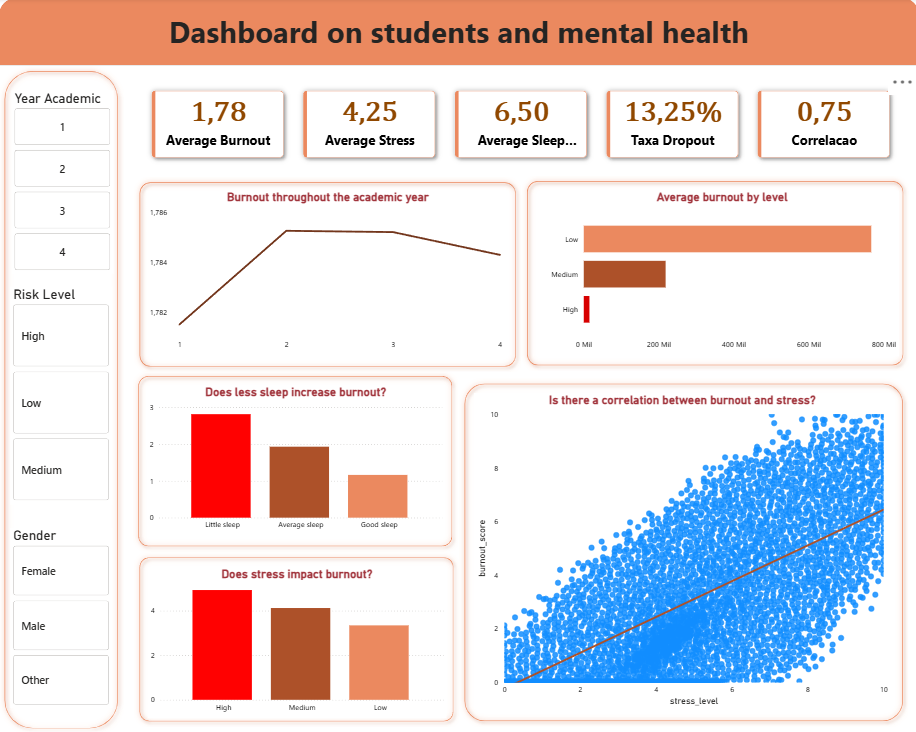

# 📊 Análise de Saúde Mental e Burnout de Estudantes

## 🧠 Visão Geral

Este projeto realiza uma análise em larga escala sobre **saúde mental e burnout de estudantes**, explorando como fatores comportamentais e acadêmicos impactam o nível de estresse e o risco de evasão. O Dataset foi retirado do Kaggle, e o link para acessá-lo está logo abaixo:

[Link do Dataset](https://www.kaggle.com/datasets/ayeshasiddiqa123/student-health/data)

O objetivo é gerar **insights acionáveis** que possam ajudar instituições educacionais a identificar padrões e agir preventivamente.

---

## 🎯 Objetivos

* Identificar fatores que influenciam o **burnout**
* Analisar a relação entre **estresse, sono e hábitos de estudo**
* Medir e interpretar o **risco de evasão (dropout)**
* Construir um dashboard interativo para análise e tomada de decisão

---

## 📸 Dashboard




---

## 📂 Estrutura do Projeto

```id="zsk4fn"
📁 Projeto
│
├── cleaned.py                              # Adição dos dados para o Banco de dados
├── Estudos_sql.sql                        # Consultas SQL para análise
├── Student_lifestyle.pbix                 # Dashboard no Power BI
├── Student_mental_health_burnout_1M.csv   # Dataset original
```

---

## 🛠️ Tecnologias Utilizadas

* 🐍 Python (Pandas | SqlAlchemy | Urlilib.parse)
* 🐘 PostgreSQL
* 📊 Power BI
* 🧠 SQL

---

## 🔄 Pipeline de Dados

1. **Dados Brutos**

   * Dataset com mais de 1 milhão de registros

2. **Adição dos Dados para o Postgre(Python)**

   * Cração do Código para conectar com o Banco de Dados

3. **Transformação (SQL)**

   * Criação de variáveis derivadas:

     * Nível de burnout
     * Faixa de sono
     * Intensidade de estudo
     * Indicador de risco de evasão

4. **Visualização (Power BI)**

   * Dashboard interativo
   * KPIs estratégicos
   * Análise de correlação

---

## 📊 Principais Métricas (KPIs)

* Média de Burnout
* Média de Estresse
* Média de Horas de Sono
* Taxa de Evasão

---

## 📈 Principais Análises

* Evolução do burnout ao longo dos anos acadêmicos
* Relação entre sono e burnout
* Distribuição de níveis de estresse
* Segmentação de risco
* 📌 **Scatter Plot (Estresse vs Burnout)**

---

## 🔍 Insights Gerados

* 📌 Existe uma **forte correlação positiva** entre estresse e burnout
* 📌 Estudantes com menos horas de sono apresentam **maiores níveis de burnout**
* 📌 Em níveis altos de estresse, o burnout se torna mais variável
* 📌 Existe um grupo com baixo burnout mesmo com estresse moderado (possível resiliência)

---

## 🚀 Como Executar

### 1. Python (Tratamento de Dados)

```bash id="r7eq6r"
python cleaned.py
```

### 2. SQL

Execute os scripts no PostgreSQL:

```sql id="l9x8dz"
-- Executar o arquivo Estudos_sql.sql
```

### 3. Power BI

* Abra o arquivo `Student_lifestyle.pbix`
* Atualize as conexões se necessário

---

## ⭐ Considerações Finais

Projeto desenvolvido com foco em **análise de dados aplicada, storytelling e geração de valor de negócio**, utilizando ferramentas amplamente utilizadas no mercado.

---
